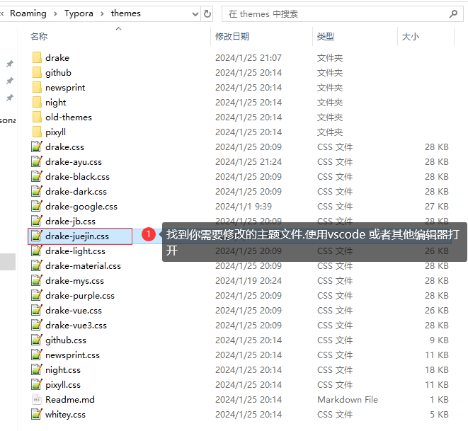
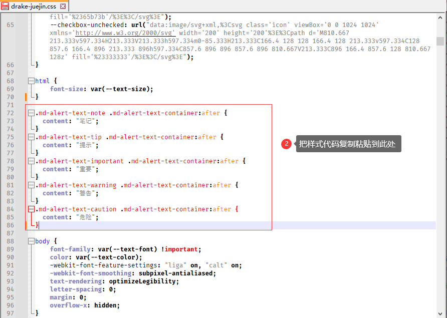
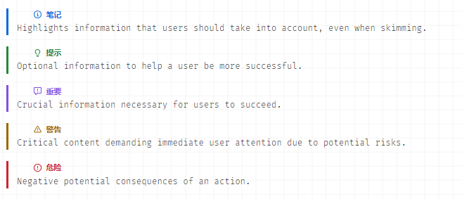
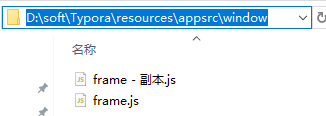
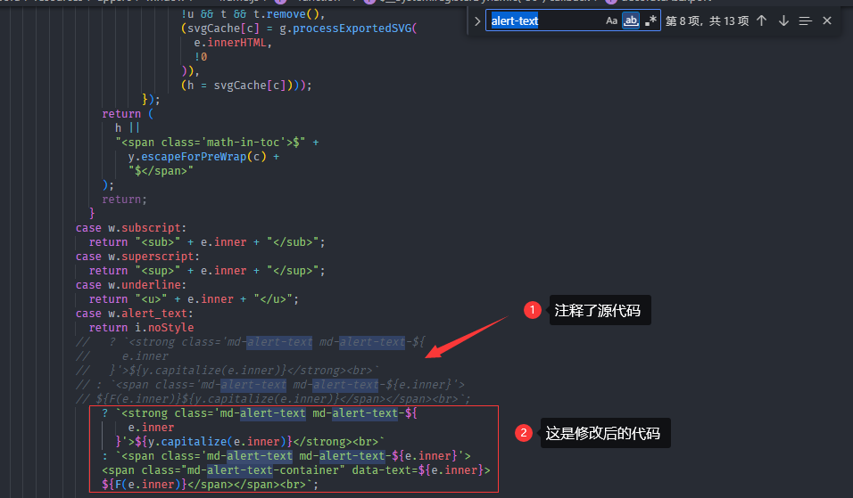
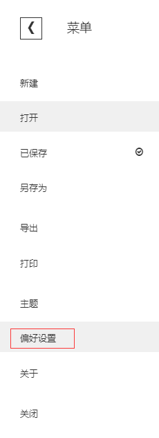
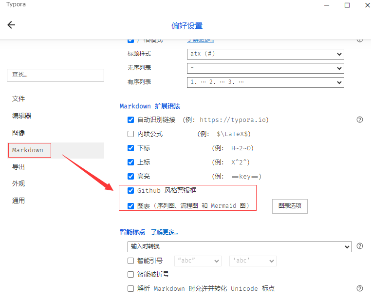
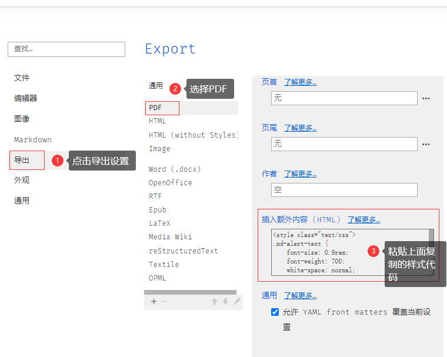
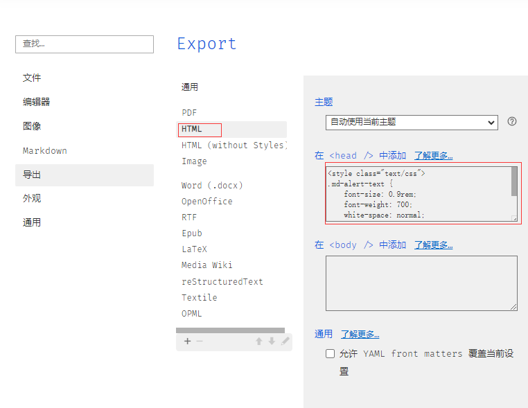
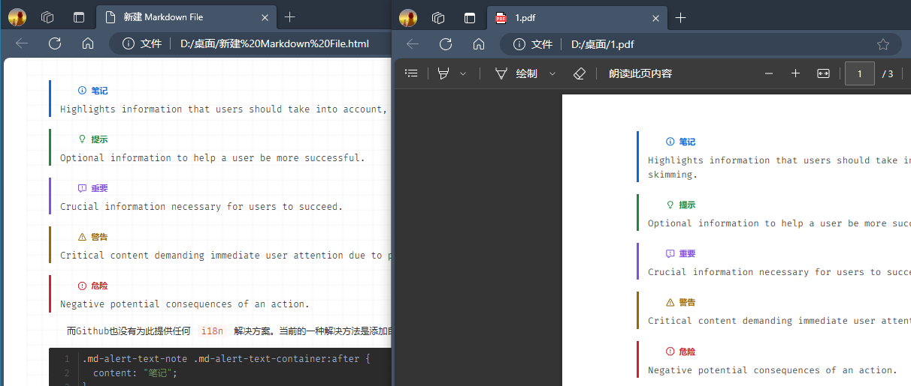

> typora版本必需是1.8.6版本.这种修改应该是支持windows,linux,mac os.因为里面修改的是基于css来实现的.唯一修改的源文件是frame.js,在面里面添加的也是span标签.下文会贴出修改部分.


# 修改theme主题


主题文件路径: `C:\Users\你的用户名\AppData\Roaming\Typora\themes`





```css
.md-alert-text-note .md-alert-text-container:after {
  content: "笔记";
}
.md-alert-text-tip .md-alert-text-container:after {
  content: "提示";
}
.md-alert-text-important .md-alert-text-container:after {
  content: "重要";
}
.md-alert-text-warning .md-alert-text-container:after {
  content: "警告";
}
.md-alert-text-caution .md-alert-text-container:after {
  content: "危险";
}
```

> [!NOTE]  
> Highlights information that users should take into account, even when skimming.

> [!TIP]
> Optional information to help a user be more successful.

> [!IMPORTANT]  
> Crucial information necessary for users to succeed.

> [!WARNING]  
> Critical content demanding immediate user attention due to potential risks.

> [!CAUTION]
> Negative potential consequences of an action.


而自带的Github 主题也没有为此提供任何 `i18n` 解决方案。当前的一种解决方法是添加自定义 CSS。例如将“Note”改为中文“注意”,这是官网给出的解决办法.



上面的设置好只是typora中显示中文.


# 导出html,pdf样式支持中文


因为官网没有做适配,只能修改文件.因为typora更新,会失效必需再次做适配.下面就是修改的方法:

1. 首先找到typora安装目录,不是上面的 theme 目录

我的是: D:\soft\Typora\

然后进入typora 里面的 resources\appsrc\window.进去之后备份frame.js文件.



我这个文件使用vscode 格式化代码,(附件中已经修改好了.只适用于1.8.6版本)



```js
              case w.alert_text:
                return i.noStyle
                  ? `<strong class='md-alert-text md-alert-text-${
                      e.inner
                    }'>${y.capitalize(e.inner)}</strong><br>`
                  : `<span class='md-alert-text md-alert-text-${e.inner}'><span class='md-alert-text-container'>${F(
                      e.inner
                    )}</span><br>`;
```

下载附件中的`frame.js` 文件覆盖到安装目录对应的文件夹下.我的是上面截图中的路径,你们需要根据自己的路径覆盖.

2. 复制下面的样式

```css
<style class="text/css">
.md-alert-text {
    font-size: 0.9rem;
    font-weight: 700;
    white-space: normal;
    line-height: 30px;
}

.md-alert-text-note .md-alert-text-container:after {
  content: "笔记";
}
.md-alert-text-tip .md-alert-text-container:after {
  content: "提示";
}
.md-alert-text-important .md-alert-text-container:after {
  content: "重要";
}
.md-alert-text-warning .md-alert-text-container:after {
  content: "警告";
}
.md-alert-text-caution .md-alert-text-container:after {
  content: "危险";
}
```

3. 打开typora 菜单中找到 偏好设置





这里默认是勾选的,如果没有勾选上面的设置是不生效的.



同样的方法 修改html



其他的格式不常用没有做适配.

关闭typora,然后再打开.

导出文件,然后对比一下看看是否成功显示中文.




到此结束!


