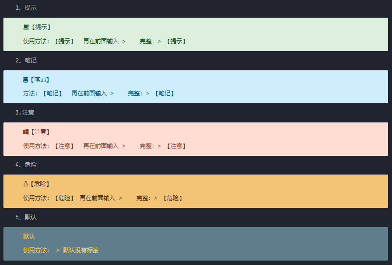

[update]

- 目前已经同步到官方最新包.

- 下面的个性化设置适用于1.2.5,1.3.6以上不适用,我也没有去适配

  > 作者反盗版变量经常改变,导致浪费时间,所有不考虑定制了.

这里是我个人typora的备份。只是备份。里面包含自定义typora theme

1、提示

> 【提示】
>
> 使用方法：【提示】  再在前面输入 >    完整：> 【提示】

2、笔记

> 【笔记】
>
> 方法：【笔记】  再在前面输入 >    完整：> 【笔记】

3.注意

> 【注意】
>
> 使用方法：【注意】  再在前面输入 >    完整：> 【注意】

4、危险

> 【危险】
>
> 使用方法：【危险】 再在前面输入 >    完整：> 【危险】

5、默认

> 默认
>
> 使用方法： > 默认没有标签



```css
这主题有问题，导出到html不显示图标不会js 后期有空在慢慢修复。
```

